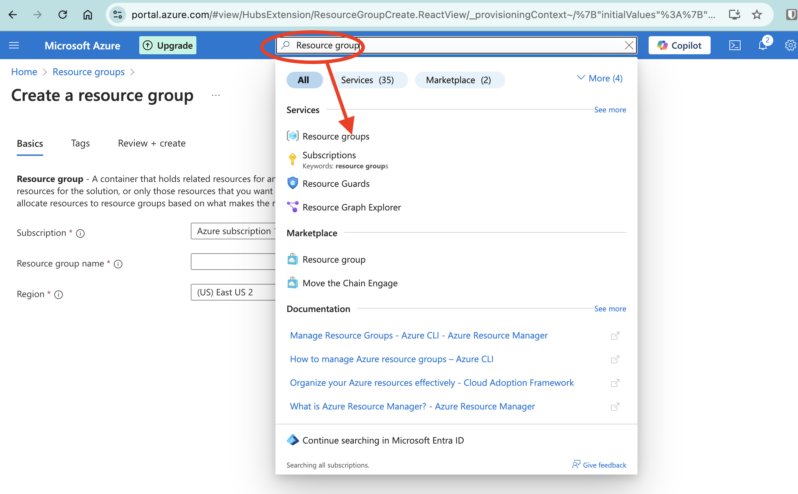
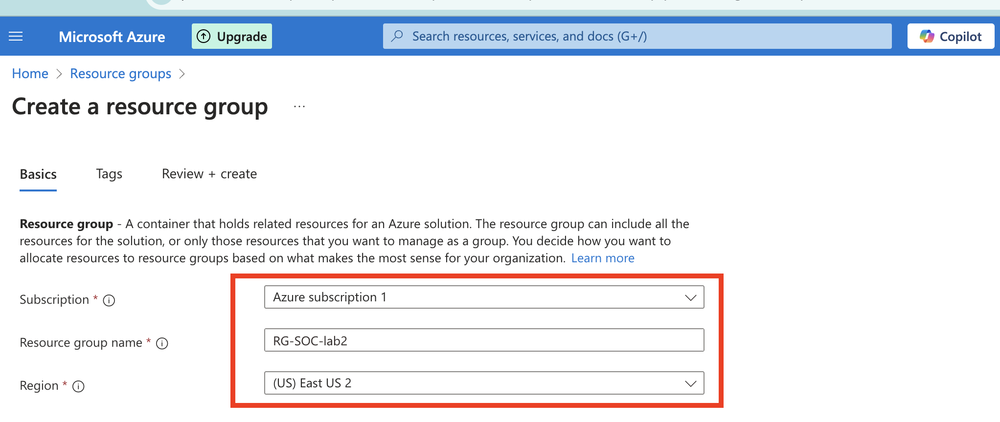
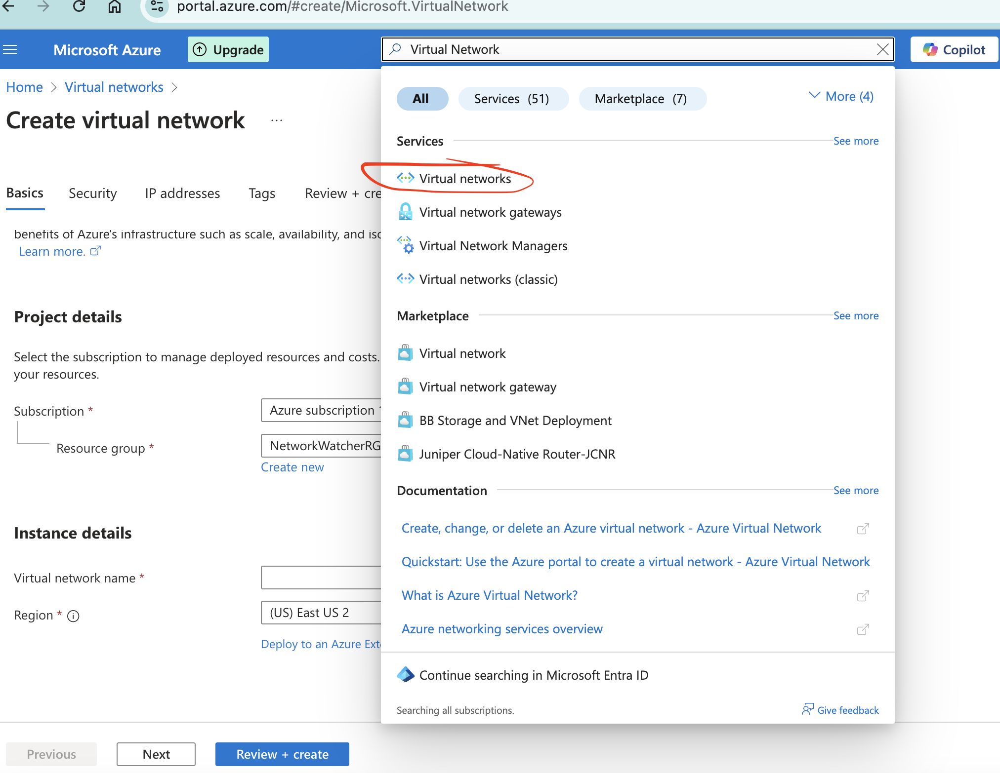
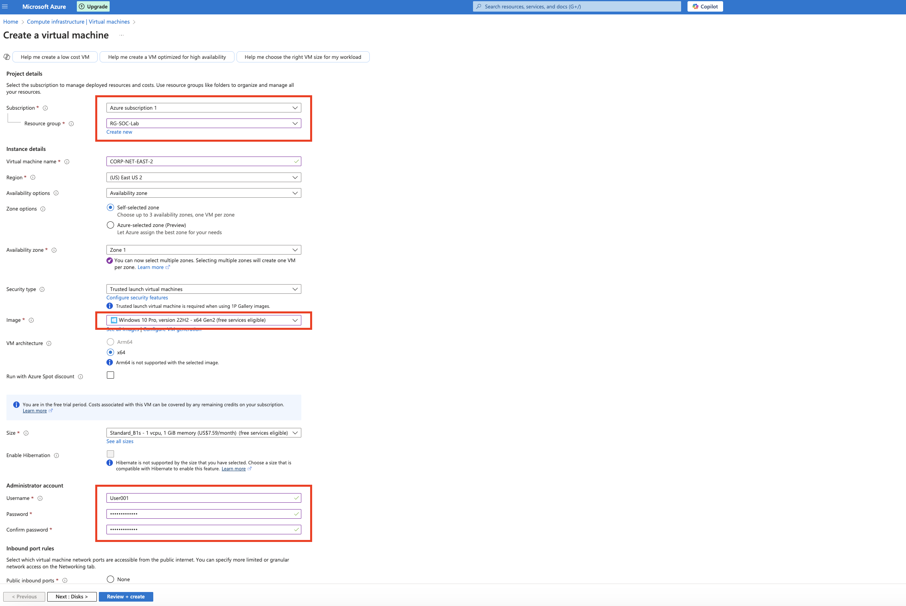
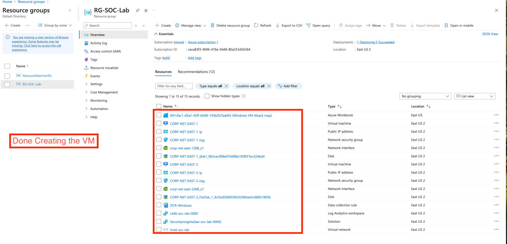
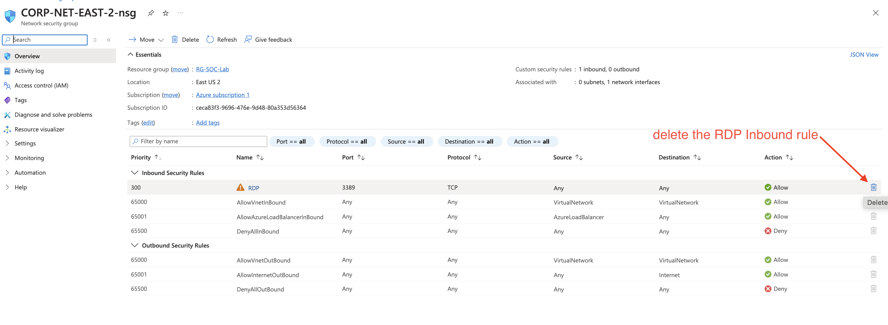
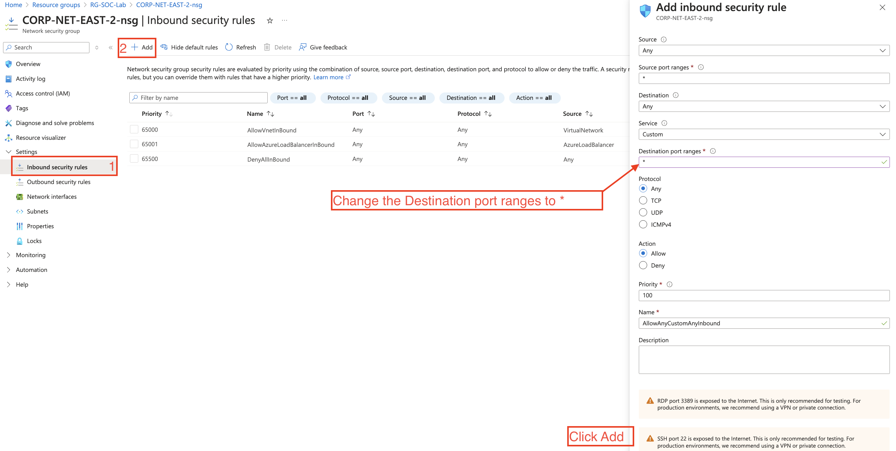
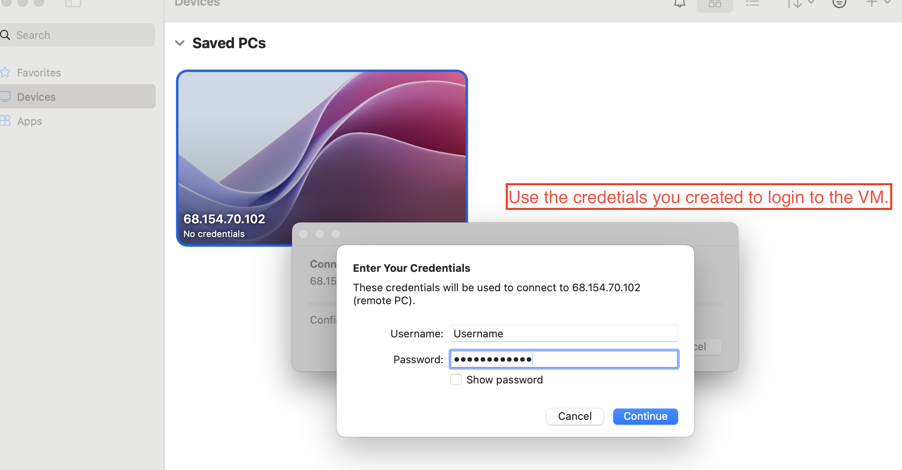
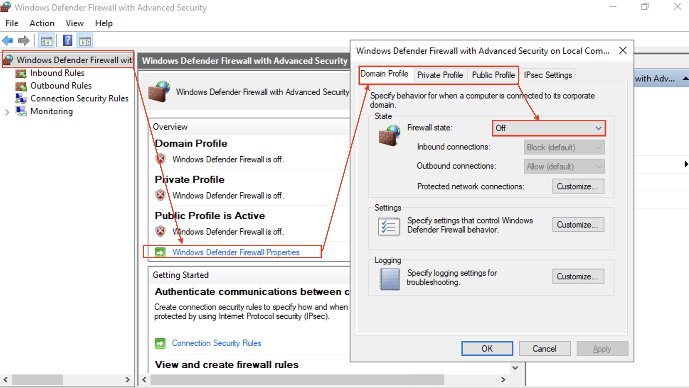

# Azure Honeypot Detection & Visualization Lab

This project walks through setting up a honeypot on Azure, capturing brute-force login attempts, enriching logs with geolocation data, and visualizing attacks using Microsoft Sentinel. It's designed for hands-on practice in security operations, SIEM, and Kusto Query Language (KQL).  

## Overview  
### By the end of this lab, you'll have:  
- Set up a honeypot on Azure
- Captured and visualized brute-force attempts
- Used KQL to analyze logs
- Enriched logs with geolocation data
- Built a live attack map using Sentinel

**This hands-on project strengthens your knowledge of Azure, Sentinel, and log analysis — key skills for any SOC Analyst.**

## Part 1: Azure Subscription Setup

1. Create a [Free Azure Subscription](https://azure.microsoft.com/en-us/pricing/purchase-options/azure-account) or use a paid subscription. If opting for a paid tier, remember to shut down/delete resources when done to avoid charges.

2. Alternatively, use the [Cyber Range](https://skool.com/cyber-range) for a flat fee and get access to:
   - Azure resources
   - Tenable & Defender for Endpoint
   - Guided labs & courses
   - Optional cybersecurity internship

3. Once set up, log in to the [Azure Portal](https://portal.azure.com).

---

## Part 2: Deploying the Honeypot (Windows VM)

1. **Create a Resource Group**  
   - In Azure Portal, search for **"Resource Groups"**.
   - Click **Create** and give it a name (e.g., `Honeypot-RG`).
   - Choose your subscription and preferred region.  
    
   

2. **Create a Virtual Network (VNet)**  
   - Navigate to **Virtual Networks** and click **Create**.
   - Name your VNet (e.g., `CORP-NET-EAST-1`) and assign it to your new Resource Group.
   - Set address space and create at least one subnet (e.g., `10.0.0.0/24`).  
   

3. **Create a Windows 10 Virtual Machine**  
   - Go to **Virtual Machines** and click **Create**.
   - Choose **Windows 10** as the image.
   - Place the VM in your existing **Resource Group** and **VNet**.
   - Select an appropriate size (smaller sizes may be enforced if you're using the Cyber Range).
   - Select a `Standard HDD` on OS disk type.
   - Set a username and password — keep these safe!  
   
   

4. **Allow All Inbound Traffic**  
   - After the VM is deployed, go to its **Network Security Group (NSG)**.
   - Add a new inbound rule to **allow all traffic** (for honeypot simulation).
   
   

5. **Start the Virtual machine**. 
   

6. **Disable Windows Firewall**  
   - RDP into the VM using the public IP address.
   - Open the firewall settings: **Start -> wf.msc -> Properties -> Turn off Domain, Private, and Public profiles**
   

## Part 3: Simulating Brute Force & Inspecting Logs
1. Attempt **three failed logins** using a dummy username like `employee`.
2. Successfully log into the VM.
3. Open **Event Viewer** and navigate to:
4. 4. Look for Event ID **4625** indicating failed login attempts.
   

## Part 4: Centralized Logging & KQL Queries

1. Create a **Log Analytics Workspace** (LAW).
2. Deploy **Microsoft Sentinel** and link it to your LAW.
3. Set up the **“Windows Security Events via AMA”** connector.
4. Use the DCR (Data Collection Rule) to ingest logs.
5. Query the logs in LAW using KQL:

SecurityEvent
| where EventId == 4625

## Part 5: Log Enrichment with Geo-IP Data
Download the IP geo database: geoip-summarized.csv.
In Sentinel, create a Watchlist:

Name/Alias: geoip

Source Type: Local File

Search Key: network

## Part 6: Building an Attack Map

In Sentinel, create a new Workbook.

Remove default elements and add a Query tile.

Switch to the Advanced Editor and paste in the JSON from map.json.

Review the query logic and map configuration.
