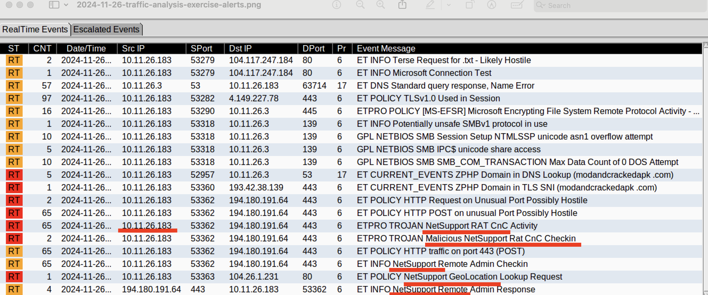
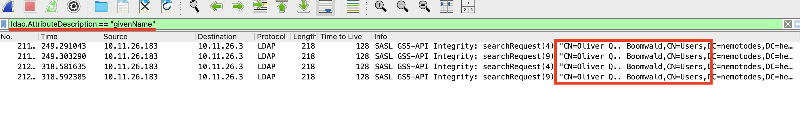
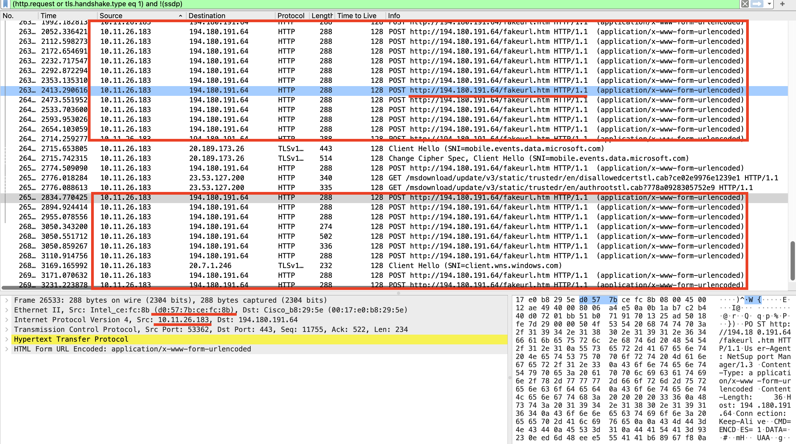
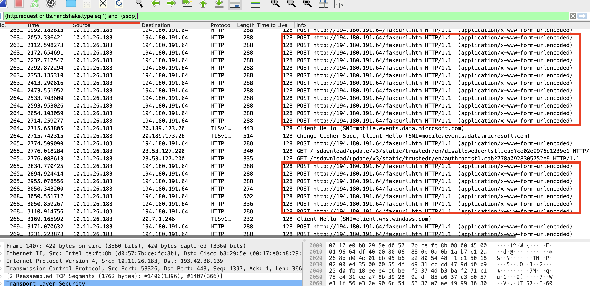

# NEMOTODES  
## About  
A Malware traffic analysis exercise from a pcap posted on Malware-Traffic-Analysis.net on 2024-11-26 by Brad Duncan.

## SCENARIO:  
• LAN segment range: 10.11.26.0/24 (10.11.26.0 through 10.11.26.255)  
• Domain: nemotodes.health  
• AD environment name: NEMOTODES  
• Domain Controller: 10.11.26.3 - NEMOTODES-DC  
• LAN segment gateway: 10.11.26.1  
• LAN segment broadcast address: 10.11.26.255  

# INCIDENT REPORT  

## 1. Executive Summary:
 **what happened (when, who, what).**
  - On Tuesday 2024-11-26, at 04:50 UTC, a Windows machine was compromised with NetSupport RAT, most likely after the user visited classicgrand.com, which led to a download from modandcrackedapk.com.

## 2. Victim Details:   
**(hostname, IP address, MAC address, Windows user account name)**  
• IP address: 10.11.26.183  
• Host name: DESKTOP-B8TQK49  
• MAC address: d0:57:7b:ce:fc:8b  
• Windows user account name: oboomwald  
• Name of victim: Oliver Q.. Boomwald  

## 3. Indicators of Compromise (IOCs):   
**IP addresses, domains and URLs associated with the activity.  SHA256 hashes.**  

• NetSupport RAT traffic: 194.180.191.164:443 – POST http://194.180.191.164/fakeurl.htm  
• SmartApeSG (ZPHP)/Fake Updates domain: modandcrackedapk.com(reference 1, reference 2)  
• Likely compromised site: classicgrand.com (reference)  

