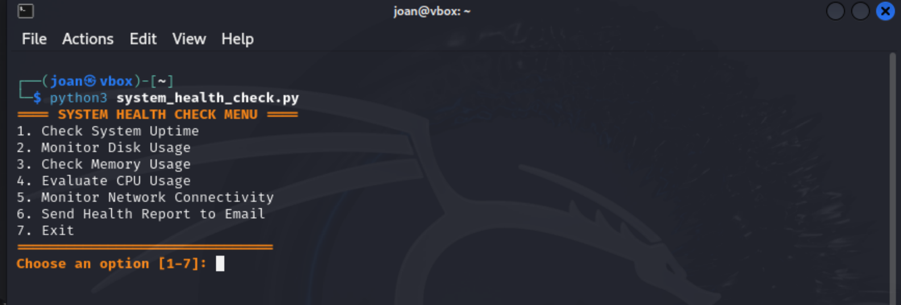
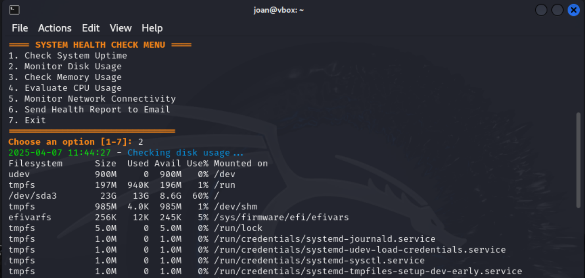
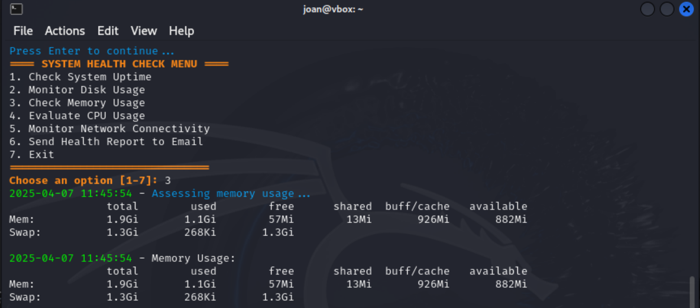
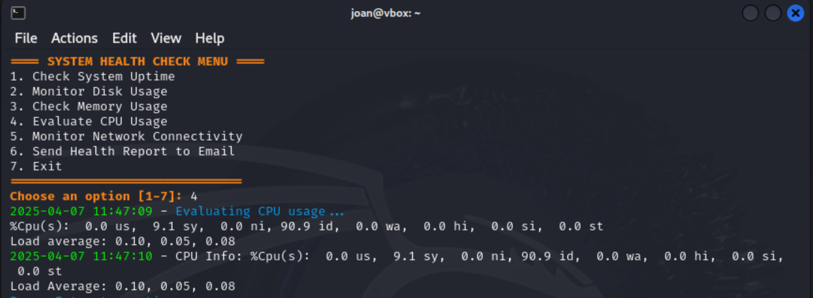
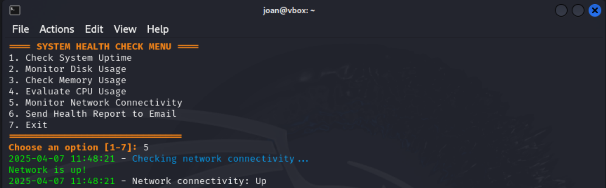
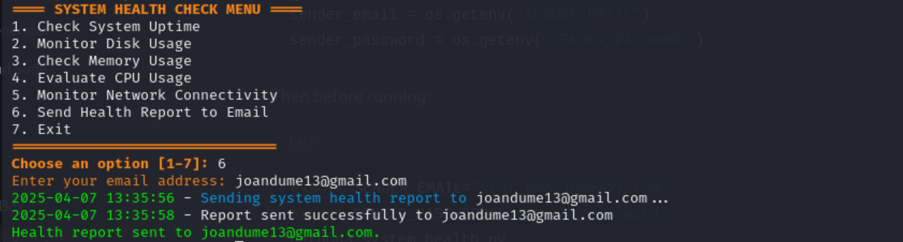
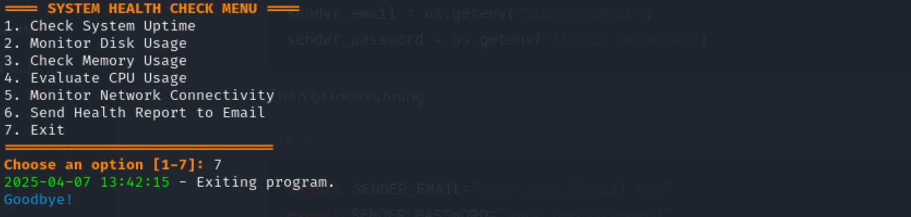

# System Health Check Automation

This Python-based **System Health Check Automation** script is designed to monitor various aspects of your system's health, including **CPU usage**, **memory usage**, **disk usage**, **network connectivity**, and **system uptime**. It provides a simple and effective way to keep track of your system's health, with the added ability to send email reports and schedule regular checks through cron jobs or systemd timers.

## Features

- **Disk Usage Monitoring**: Check the free space and disk usage across your system to ensure you don't run out of storage.
- **Memory Usage Assessment**: Monitor system memory utilization, helping you detect any potential memory overuse.
- **CPU Usage Evaluation**: Track CPU load and processes to detect any potential performance bottlenecks.
- **Network Connectivity Check**: Verify that your system has active network access and connectivity.
- **System Uptime**: View the system's uptime, which helps you monitor when the system was last restarted.
- **Email Reports**: Automatically send system health reports to your email.
- **Automation**: Schedule automatic health checks using cron jobs or systemd timers for Linux-based systems, or Windows Task Scheduler for Windows users.

---

## Files

### `system_health.py`
- Core Python script for executing system health checks.
- Offers an interactive menu to trigger different checks.
- Automatically logs each action and its output.
- Supports sending log results via email (basic SMTP setup required).
- Includes email validation and connection error handling.

---

## How It Works

### Menu Options
Once the script runs, you'll be presented with a menu to choose from:  

 **Run the script and pick an option from the menu.**  
 

1. **Check System Uptime**. 


2. **Monitor Disk Usage**. 


3. **Check Memory Usage**
. 

4. **Evaluate CPU Usage**. 


5. **Monitor Network Connectivity**. 
. 

6. **Send Health Report to Email**. 


7. **Exit**.  



   >  Don't forget to check your inbox for the system report (make sure SMTP is correctly configured).

### Email Report
- The report is sent from a configured Gmail account.
- You’ll be prompted to enter a recipient email.
- Email validation is enforced before sending.
- Make sure to update credentials inside the script before use.

---

## Installation & Usage

1. **Clone the repository:**
   ```bash
   git clone https://github.com/yourusername/system-health-check.git
   cd system-health-check
   ```

2. **Update Email Credentials:**
   Open `system_health_check.py` and update:
   ```python
   sender_email = "your_email@gmail.com"
   sender_password = "your_email_password"
   ```
3. **Install Required Dependences:**
   ```bash
   sudo apt update
   sudo apt install python3-psutil -y
   ```

4. **Run the script:**
   ```bash
   python3 system_health_check.py
   ```
---

## Notes

- Email functionality depends on external SMTP server access and correct credentials.
- Logging is enabled by default to `/tmp/system_health.log`.
- Script uses Linux-native commands and may not work on Windows without adaptation.
- No third-party dependencies — runs on standard Python 3 with `psutil` included by default in most Linux distributions.

---

## License

This project is licensed under the MIT License. See the [LICENSE](LICENSE) file for more details.

```
